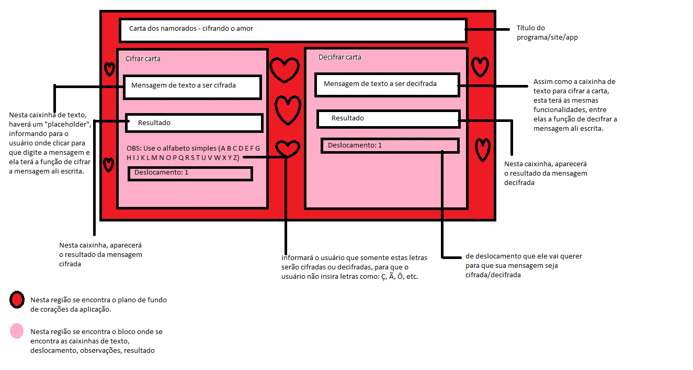
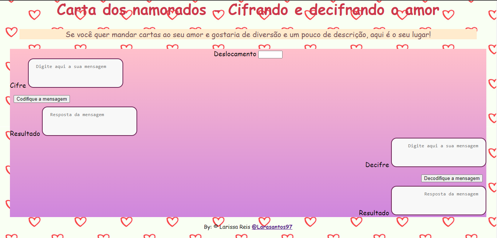

# Cifra de César

## Índice

- [1. Prefácio](#1-prefácio)
- [2. Sobre cifrando e decifrando o amor](#2-Sobre-cifrando-e-decifrando-o-amor)

---

## 1. Prefácio

Cifrar significa codificar. A [cifra de César](https://pt.wikipedia.org/wiki/Cifra_de_C%C3%A9sar)
é um dos primeiros tipos de criptografias conhecidas na história.
O imperador romano Júlio César utilizava essa cifra para enviar
ordens secretas aos seus generais no campo de batalha.

A cifra de César é uma das técnicas mais simples de cifrar uma mensagem. É um
tipo de cifra por substituição, em que cada letra do texto original é
substituida por outra que se encontra há um número fixo de posições
(deslocamento) mais a frente do mesmo alfabeto.

Por exemplo se usarmos o deslocamento (_offset_) de 3 posições:

- Alfabeto sem cifrar: A B C D E F G H I J K L M N O P Q R S T U V W X Y Z
- Alfabeto com cifra: D E F G H I J K L M N O P Q R S T U V W X Y Z A B C
- A letra A será D
- A palavra CASA será FDVD

Atualmente todas as cifras de substituição alfabética simples, são decifradas
com facilidade e não oferecem muita segurança na comunicação por si mesma,
mas a cifra de César muitas vezes pode fazer parte de um sistema
mais complexo de criptografia, como
a cifra de Vigenère, e tem aplicação no sistema ROT13.

No README.md, escreva como você definiu seu usuário e qual foi o processo para
definir o produto final a nível de experiência e interface.

- Quem são os principais usuário do produto?
- Quais são os objetivos do usuário em relação com o produto?
- Como você acredita que o produto está resolvendo os problemas do usuário?

## 2. Sobre Cifrando e decifrando o amor

### Esboço do projeto

 

### Fase final 

### Fluxograma do processo de criação

### Definição do usuário

O usuário foi pensado nos amantes, que gostariam de viver uma aventura escrevendo cartas onde somente eles saberão o significado, tendo descrição em uma interface fácil de usar.

### Processo para definir o produto final a nível de experiência e interface

O processo de execução foi feito primeiramente em um esboço da página no programa "paint", pensando em como o usuário conseguiria utilizar a interface sem dificuldades. A princípio, ao criar a página de acordo com o primeiro esboço, foi visto como seria se simplificasse um pouco mais alguns itens da página para que o usuário não precise preencher informações mais vezes do que o necessário, no caso do campo de deslocamento, que antes teria nos dois blocos, sendo eles "Cifrar" e "Decifrar", agora se encontra no inicio, onde será colocado antes de inserir o texto desejado para ser cifrado/decifrado.

### Interface do usuário (UI)

A interface permite o usuário:

- Eleger um _offset_ indicando quantas posições de deslocamento de caracteres
  quer que a cifra utilize.
- Inserir uma mensagem (texto) para ser cifrada.
- Ver o resultado da mensagem cifrada.
- Inserir uma mensagem (texto) para ser decifrada.
- Ver o resultado da mensagem decifrada.

